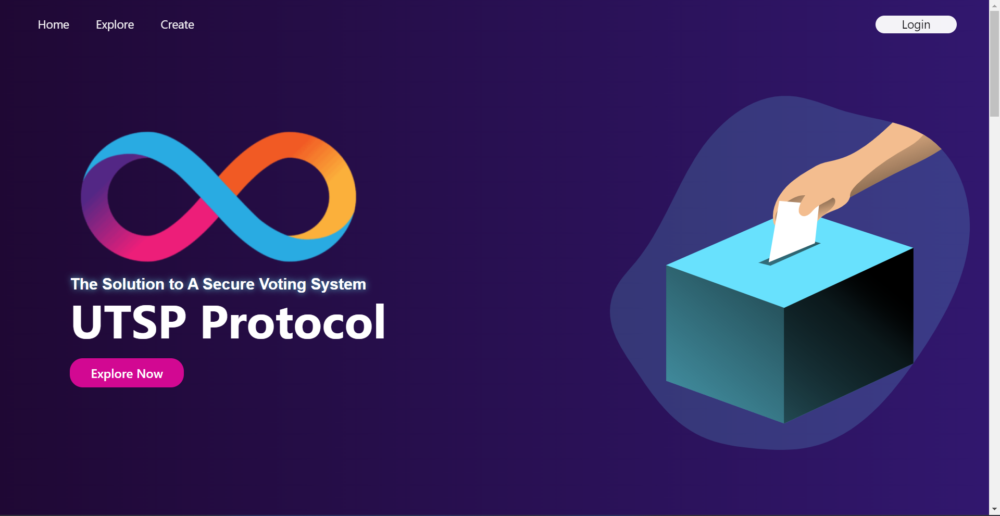

# UTSP Protocol Project

### Overview
This Project is an implementation of a Secure Digital Voting System Using Internet Computer called UTSP Protocol

Read More About UTSP Protocol [Here](utsp_protocol)

The Project Will Be Divided into 2 Directories:
- [Internet Computer DIP-721 Example Token](dip721-nft-container)
- [UTSP Protocol Application](utsp_protocol)
