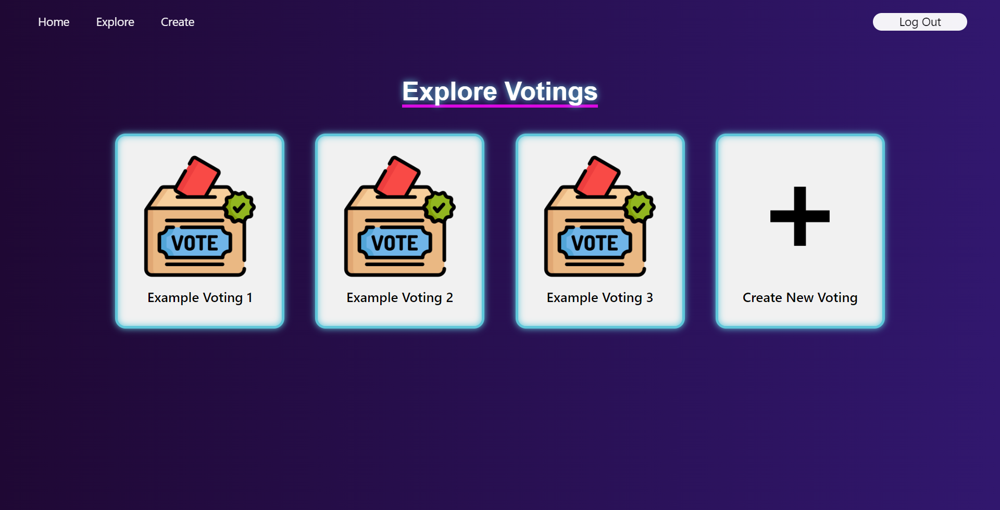
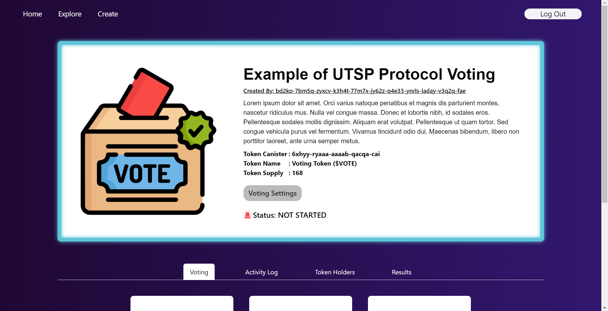
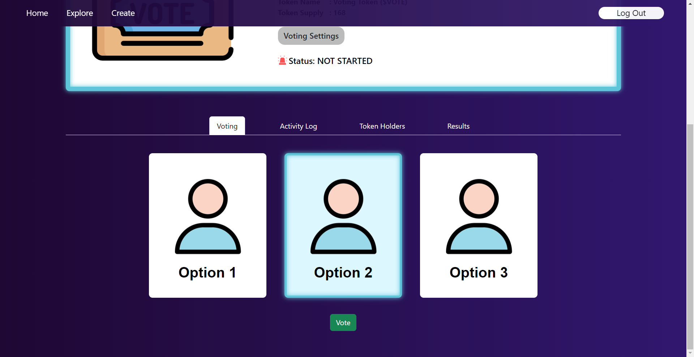
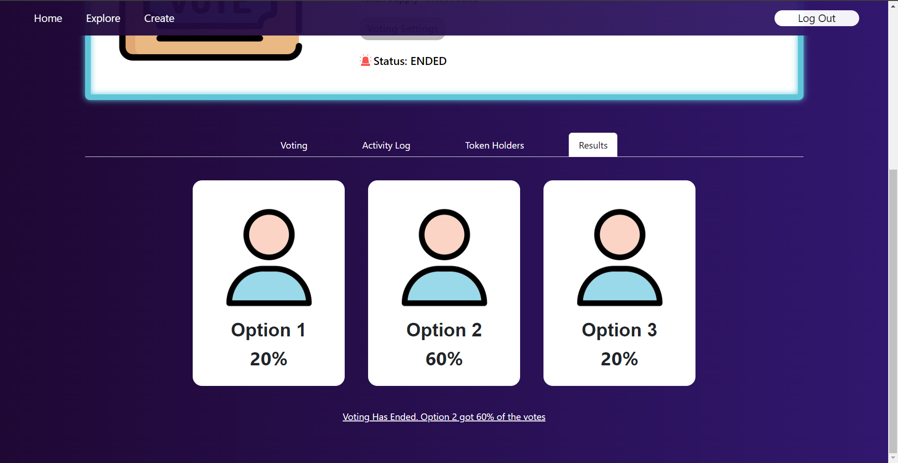

# UTSP Protocol Project

## Overview
This Project is an implementation of a Secure Digital Voting System Using Internet Computer called UTSP Protocol. Read More About UTSP Protocol [Here](utsp_protocol)

The Project Will Be Divided into 2 Directories:
### [Internet Computer DIP-721 Example Token](dip721-nft-container)
An Example of DIP-721 Token Standard to create a token on Internet Computer as a Voting Token for UTSP Protocol Voting Sessions

### [UTSP Protocol Application](utsp_protocol)
The Main Internet Computer Application of UTSP Protocol which manages all Voting Sessions, both frontend and backend.

## Application Overview
### Home Page

### Explore Page

### Voting Page

### Voting Options

### Voting Results

## Demo Video

Watch UTSP Protocol Demo Video on Youtube [Here](https://www.youtube.com/watch?v=dvLAViH0lnI).
